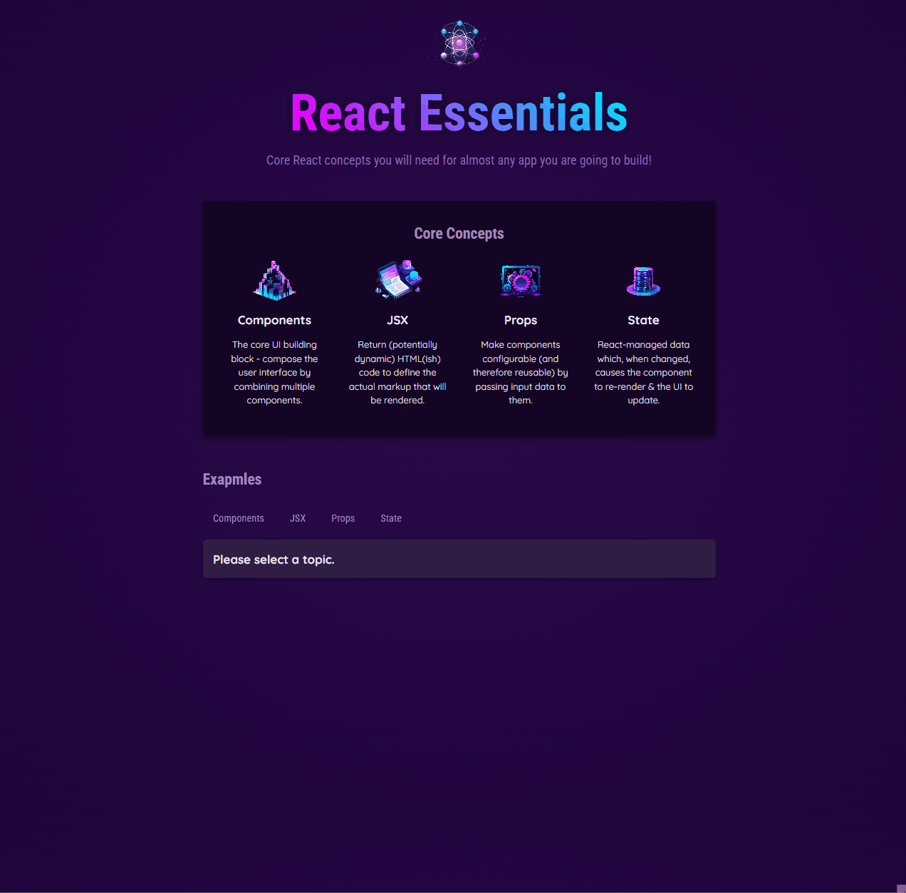
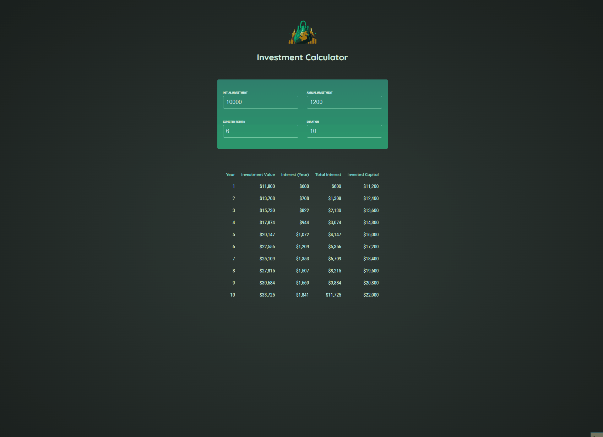
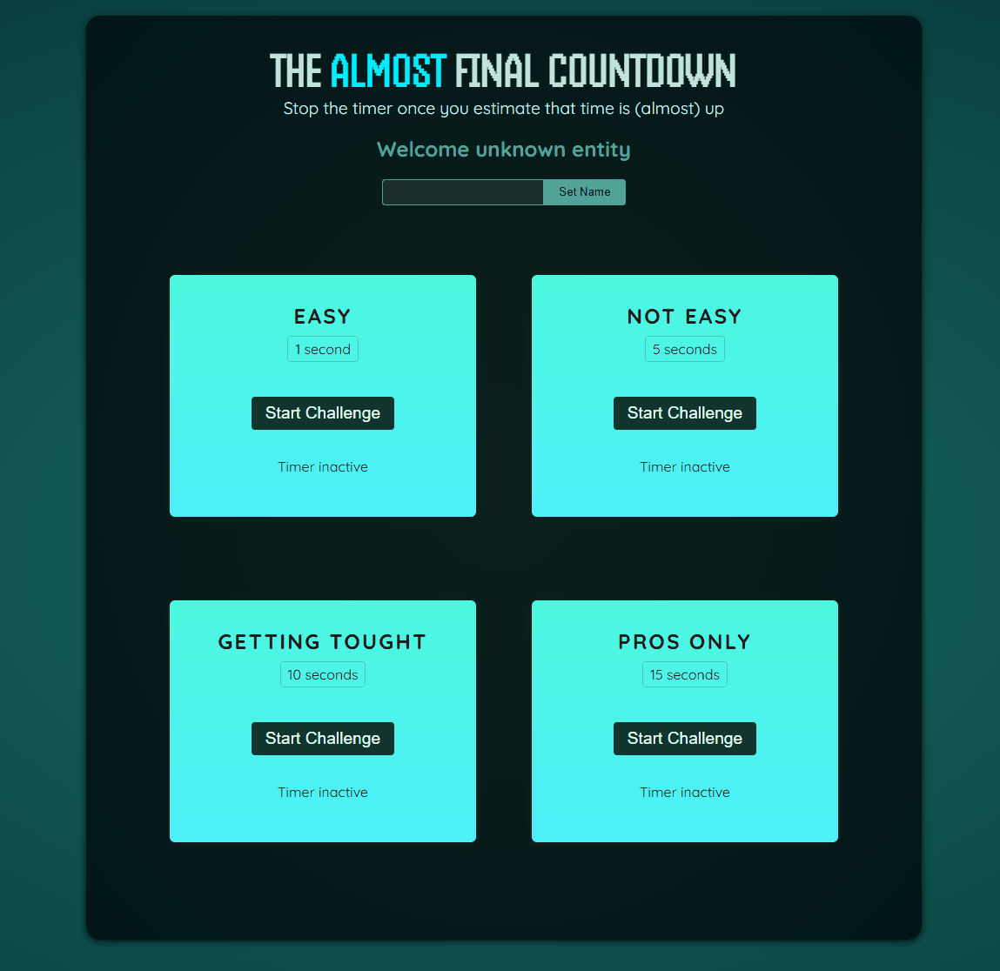

# React-The-CompleteGuide

**Maximilian Schwarzmuller - React - The Complete Guide You can find the projects done in the course below. If you want, you can access the codes by pressing on the gifts.**

**:one:React Essentials**  

**:two:Tic Tac Toe**  

**:three:Investment Calculator**  

**:four:Refs Portals**  

